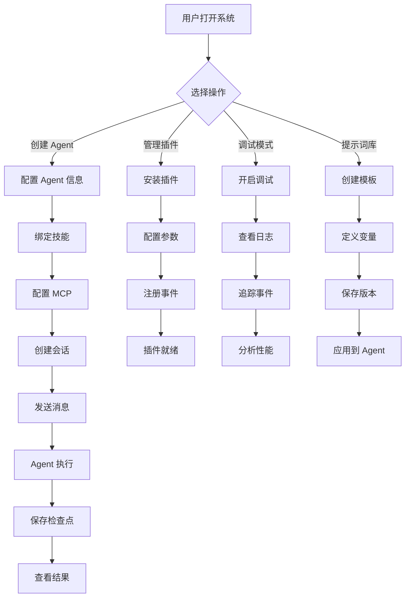

# AI Agent Studio - 产品需求文档 (PRD)

## 1. 产品概述

AI Agent Studio 是一个前后端分离的跨平台 AI Agent 开发与调试平台，为开发者提供可视化的 Agent 构建、测试和管理环境。

- **主要用途**：帮助开发者快速构建、调试和管理 AI Agent，支持插件扩展、技能编排和模型上下文协议
- **解决的问题**：降低 AI Agent 开发门槛，提供统一的调试和管理界面
- **目标用户**：AI 应用开发者、Agent 构建者、技术团队
- **市场价值**：填补 AI Agent 开发工具链的空白，提升开发效率

## 2. 核心功能

### 2.1 用户角色

| 角色 | 注册方式 | 核心权限 |
|------|---------|---------|
| 开发者 | 本地部署直接使用 | 创建/编辑 Agent、管理插件、调试会话、管理提示词库 |

### 2.2 功能模块

1. **主控台（Dashboard）**：系统概览、快速操作入口
2. **会话管理（Conversations）**：对话历史、检查点、会话恢复
3. **Agent 工作台（Agent Workbench）**：Agent 配置、技能绑定、MCP 连接
4. **插件管理（Plugins）**：插件安装、配置、事件监听
5. **提示词库（Prompt Library）**：提示词模板、变量管理、版本控制
6. **调试中心（Debug Center）**：实时日志、事件追踪、性能分析
7. **设置中心（Settings）**：主题切换、API 配置、系统参数

### 2.3 页面详情

| 页面名称 | 模块名称 | 功能描述 |
|---------|---------|---------|
| 主控台 | 统计卡片 | 显示活跃会话数、插件数、技能数、提示词数 |
| 主控台 | 快速操作 | 新建会话、创建 Agent、导入插件快捷入口 |
| 主控台 | 最近活动 | 最近使用的 Agent、会话、插件列表 |
| 会话管理 | 会话列表 | 显示所有会话，支持搜索、筛选、删除 |
| 会话管理 | 会话详情 | 对话内容展示、检查点标记、会话恢复、导出 |
| 会话管理 | 检查点面板 | 显示会话检查点时间线，支持回滚到任意检查点 |
| Agent 工作台 | Agent 配置 | 名称、描述、系统提示词、模型选择 |
| Agent 工作台 | 技能绑定 | 为 Agent 绑定可用技能，配置技能参数 |
| Agent 工作台 | MCP 连接 | 配置 MCP 服务器连接，管理工具集 |
| 插件管理 | 插件列表 | 显示已安装插件，支持启用/禁用、卸载 |
| 插件管理 | 插件详情 | 插件信息、配置项、事件监听器、日志 |
| 插件管理 | 插件安装 | 从本地文件或 URL 安装插件 |
| 提示词库 | 提示词列表 | 显示所有提示词模板，支持分类、搜索 |
| 提示词库 | 提示词编辑 | 创建/编辑提示词，支持变量插值、版本管理 |
| 提示词库 | 变量管理 | 定义提示词变量，设置默认值和描述 |
| 调试中心 | 实时日志 | 显示 Agent 执行日志，支持级别筛选 |
| 调试中心 | 事件追踪 | 可视化事件流，显示事件触发链路 |
| 调试中心 | 性能分析 | 显示响应时间、token 使用、错误率等指标 |
| 设置中心 | 主题设置 | 多主题切换（深色/浅色/自定义） |
| 设置中心 | API 配置 | 配置 LLM API 密钥、端点 |
| 设置中心 | 系统参数 | 调试模式开关、日志级别、检查点策略 |

## 3. 核心流程

### 3.1 创建并运行 Agent 流程

用户创建 Agent → 配置基本信息 → 绑定技能 → 配置 MCP 连接 → 创建会话 → 发送消息 → Agent 执行 → 查看结果 → 保存检查点

### 3.2 插件开发流程

开发者编写 JS 插件 → 定义事件监听器 → 安装插件 → 配置参数 → 插件自动注册事件 → 系统触发事件 → 插件执行逻辑

### 3.3 流程图

## 4. 用户界面设计

### 4.1 设计风格

- **主色调**：深空蓝 (#0f172a) + 霓虹青 (#06b6d4) + 琥珀橙 (#f59e0b)
- **辅助色**：紫罗兰 (#8b5cf6) + 翡翠绿 (#10b981) + 玫瑰红 (#f43f5e)
- **按钮样式**：圆角矩形 (8px)，悬停时发光效果，点击时微缩放
- **字体**：
  - 标题：Space Grotesk (现代科技感)
  - 正文：JetBrains Mono (代码友好)
  - 中文：思源黑体
- **布局风格**：左侧导航 + 主内容区，卡片式布局，毛玻璃效果
- **图标风格**：线性图标 + 渐变填充，科技感

### 4.2 页面设计概览

| 页面名称 | 模块名称 | UI 元素 |
|---------|---------|---------|
| 主控台 | 统计卡片 | 渐变背景卡片，数字动画，图标装饰 |
| 主控台 | 快速操作 | 大按钮，悬停发光，图标 + 文字 |
| 会话管理 | 会话列表 | 列表项带状态指示器，时间戳，操作按钮 |
| 会话管理 | 检查点面板 | 时间轴组件，节点标记，回滚按钮 |
| Agent 工作台 | 技能绑定 | 拖拽列表，技能卡片，启用开关 |
| 调试中心 | 事件追踪 | 流程图可视化，节点连线，事件详情弹窗 |
| 设置中心 | 主题设置 | 主题预览卡片，单选按钮，实时预览 |

### 4.3 响应式

- **桌面优先**：最小宽度 1280px，推荐 1920px
- **平板适配**：768px - 1279px，侧边栏可折叠
- **移动端**：暂不支持，后续版本考虑

### 4.4 主题系统

支持三种预设主题：
1. **深空主题**（默认）：深色背景 + 霓虹强调色
2. **极光主题**：浅色背景 + 柔和渐变
3. **赛博主题**：高对比度深色 + 荧光色

支持自定义主题：用户可调整主色调、强调色、字体大小

## 5. 技术特性

### 5.1 插件系统

- **开发语言**：JavaScript (ES6+)
- **事件服务**：基于发布-订阅模式的事件总线
- **生命周期钩子**：`onLoad`, `onUnload`, `onMessage`, `onCheckpoint`
- **API 暴露**：提供 `agent`, `session`, `logger`, `config` 等 API

### 5.2 Skills 系统

- **技能定义**：JSON Schema 描述技能输入输出
- **技能执行**：支持同步/异步执行，超时控制
- **技能市场**：内置常用技能（代码执行、文件操作、网络请求等）

### 5.3 MCP 支持

- **协议版本**：Model Context Protocol 2024-11-05
- **传输方式**：stdio, SSE, WebSocket
- **工具发现**：自动发现 MCP 服务器提供的工具
- **资源管理**：支持 MCP 资源和提示词模板

### 5.4 检查点系统

- **自动保存**：可配置的检查点策略（每条消息、每 N 条、手动）
- **状态快照**：保存完整的会话状态、上下文、变量
- **时间旅行**：支持回滚到任意检查点，分支探索

### 5.5 调试模式

- **实时日志**：分级日志（DEBUG, INFO, WARN, ERROR）
- **事件追踪**：可视化事件流，显示触发链路
- **性能监控**：响应时间、token 使用、内存占用
- **断点调试**：支持在技能执行处设置断点

### 5.6 提示词库

- **模板管理**：创建、编辑、删除、分类
- **变量插值**：支持 `{{variable}}` 语法，运行时替换
- **版本控制**：提示词版本历史，支持回滚
- **导入导出**：支持 JSON/YAML 格式导入导出
