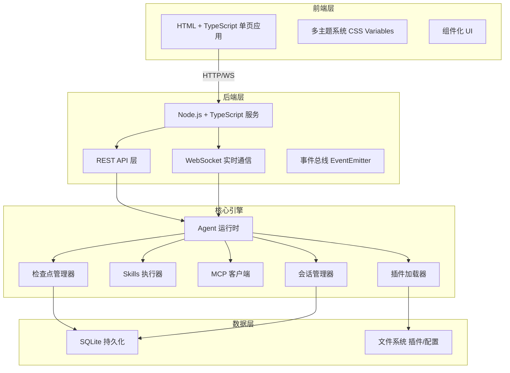
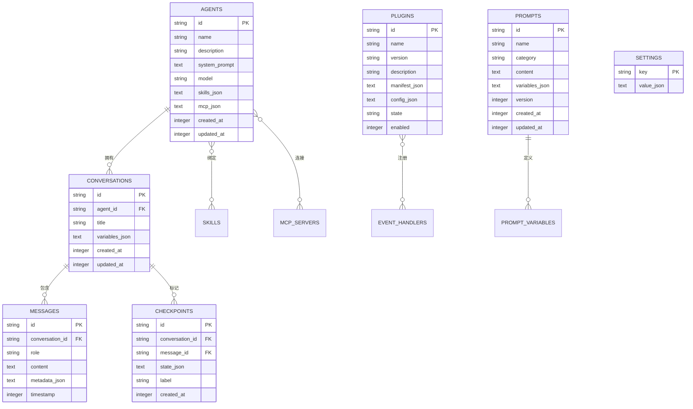

# AI Agent Studio - 技术架构文档

## 1. 架构设计



## 2. 技术说明

- **前端**：纯 HTML + TypeScript + CSS Variables，无框架依赖，Vite 构建
- **后端**：Node.js + TypeScript，Express HTTP 服务 + ws WebSocket
- **数据库**：better-sqlite3 轻量嵌入式
- **插件系统**：VM2 沙箱加载 JS 插件，事件驱动
- **构建工具**：Vite (前端) + tsup (后端)
- **包管理**：pnpm workspace monorepo

## 3. 项目结构

```
ai-agent-studio/
├── package.json                 # monorepo 根配置
├── pnpm-workspace.yaml
├── packages/
│   ├── shared/                  # 前后端共享类型
│   │   ├── package.json
│   │   └── src/
│   │       └── types.ts         # 共享类型定义
│   ├── server/                  # 后端服务
│   │   ├── package.json
│   │   ├── tsconfig.json
│   │   └── src/
│   │       ├── index.ts         # 入口：启动 HTTP + WS
│   │       ├── api/             # REST API 路由
│   │       │   ├── agents.ts
│   │       │   ├── conversations.ts
│   │       │   ├── plugins.ts
│   │       │   ├── prompts.ts
│   │       │   └── settings.ts
│   │       ├── core/            # 核心引擎
│   │       │   ├── agent-runtime.ts
│   │       │   ├── event-bus.ts
│   │       │   ├── checkpoint.ts
│   │       │   ├── session.ts
│   │       │   ├── skill-runner.ts
│   │       │   └── mcp-client.ts
│   │       ├── plugin/          # 插件系统
│   │       │   ├── loader.ts
│   │       │   └── sandbox.ts
│   │       ├── db/              # 数据库
│   │       │   ├── index.ts
│   │       │   └── schema.sql
│   │       └── ws/              # WebSocket 处理
│   │           └── handler.ts
│   └── client/                  # 前端
│       ├── package.json
│       ├── index.html
│       ├── vite.config.ts
│       ├── tsconfig.json
│       └── src/
│           ├── main.ts          # 入口
│           ├── app.ts           # 应用主逻辑
│           ├── router.ts        # 简易路由
│           ├── api.ts           # HTTP 客户端
│           ├── ws.ts            # WebSocket 客户端
│           ├── store.ts         # 状态管理
│           ├── themes/          # 主题系统
│           │   ├── index.ts
│           │   ├── deep-space.css
│           │   ├── aurora.css
│           │   └── cyber.css
│           ├── views/           # 页面视图
│           │   ├── dashboard.ts
│           │   ├── conversations.ts
│           │   ├── agent-workbench.ts
│           │   ├── plugins.ts
│           │   ├── prompts.ts
│           │   ├── debug.ts
│           │   └── settings.ts
│           └── components/      # UI 组件
│               ├── sidebar.ts
│               ├── card.ts
│               ├── modal.ts
│               ├── toast.ts
│               └── chat.ts
└── plugins/                     # 用户插件目录
    └── example/
        ├── plugin.json
        └── index.js
```

## 4. 路由定义

### 前端路由（Hash Router）

| 路由 | 用途 |
|------|------|
| #/ | 主控台 Dashboard |
| #/conversations | 会话管理列表 |
| #/conversations/:id | 会话详情 + 检查点 |
| #/agents | Agent 列表 |
| #/agents/:id | Agent 工作台 |
| #/plugins | 插件管理 |
| #/prompts | 提示词库 |
| #/debug | 调试中心 |
| #/settings | 设置中心 |

### 后端 API 路由

| 方法 | 路径 | 用途 |
|------|------|------|
| GET | /api/agents | 获取 Agent 列表 |
| POST | /api/agents | 创建 Agent |
| GET | /api/agents/:id | 获取 Agent 详情 |
| PUT | /api/agents/:id | 更新 Agent |
| DELETE | /api/agents/:id | 删除 Agent |
| GET | /api/conversations | 获取会话列表 |
| POST | /api/conversations | 创建会话 |
| GET | /api/conversations/:id | 获取会话详情含消息 |
| DELETE | /api/conversations/:id | 删除会话 |
| POST | /api/conversations/:id/checkpoints | 创建检查点 |
| POST | /api/conversations/:id/rollback/:cpId | 回滚到检查点 |
| GET | /api/plugins | 获取插件列表 |
| POST | /api/plugins/install | 安装插件 |
| PUT | /api/plugins/:id/config | 更新插件配置 |
| DELETE | /api/plugins/:id | 卸载插件 |
| GET | /api/prompts | 获取提示词列表 |
| POST | /api/prompts | 创建提示词 |
| PUT | /api/prompts/:id | 更新提示词 |
| DELETE | /api/prompts/:id | 删除提示词 |
| GET | /api/settings | 获取系统设置 |
| PUT | /api/settings | 更新系统设置 |
| POST | /api/chat | 发送消息给 Agent（SSE 流式） |

### WebSocket 事件

| 事件名 | 方向 | 用途 |
|--------|------|------|
| chat:message | C→S | 发送聊天消息 |
| chat:stream | S→C | 流式响应 |
| chat:done | S→C | 响应完成 |
| debug:log | S→C | 调试日志推送 |
| debug:event | S→C | 事件追踪推送 |
| checkpoint:created | S→C | 检查点创建通知 |

## 5. 核心类型定义

```typescript
// === Agent ===
interface Agent {
  id: string;
  name: string;
  description: string;
  systemPrompt: string;
  model: string;
  skills: string[];        // 绑定的技能 ID
  mcpServers: McpConfig[]; // MCP 连接配置
  createdAt: number;
  updatedAt: number;
}

// === 会话 ===
interface Conversation {
  id: string;
  agentId: string;
  title: string;
  messages: Message[];
  checkpoints: Checkpoint[];
  variables: Record<string, any>;
  createdAt: number;
  updatedAt: number;
}

interface Message {
  id: string;
  role: 'user' | 'assistant' | 'system' | 'tool';
  content: string;
  timestamp: number;
  metadata?: Record<string, any>;
}

// === 检查点 ===
interface Checkpoint {
  id: string;
  conversationId: string;
  messageId: string;       // 关联的消息
  state: {
    messages: Message[];
    variables: Record<string, any>;
  };
  label?: string;
  createdAt: number;
}

// === 插件 ===
interface PluginManifest {
  name: string;
  version: string;
  description: string;
  main: string;            // 入口文件
  config?: Record<string, ConfigField>;
  events?: string[];       // 监听的事件列表
}

interface PluginInstance {
  manifest: PluginManifest;
  enabled: boolean;
  config: Record<string, any>;
  state: 'loaded' | 'error' | 'disabled';
}

// === 事件总线 ===
type EventCallback = (payload: any) => void | Promise<void>;

interface EventBus {
  on(event: string, callback: EventCallback): void;
  off(event: string, callback: EventCallback): void;
  emit(event: string, payload: any): Promise<void>;
}

// === 技能 ===
interface SkillDefinition {
  id: string;
  name: string;
  description: string;
  parameters: JSONSchema;
  returns: JSONSchema;
  execute: (params: any, context: SkillContext) => Promise<any>;
}

// === MCP ===
interface McpConfig {
  name: string;
  transport: 'stdio' | 'sse' | 'websocket';
  command?: string;
  url?: string;
  env?: Record<string, string>;
}

// === 提示词 ===
interface PromptTemplate {
  id: string;
  name: string;
  category: string;
  content: string;          // 支持 {{variable}} 插值
  variables: PromptVariable[];
  version: number;
  createdAt: number;
  updatedAt: number;
}

interface PromptVariable {
  name: string;
  description: string;
  defaultValue?: string;
  required: boolean;
}

// === 设置 ===
interface Settings {
  theme: 'deep-space' | 'aurora' | 'cyber' | 'custom';
  customTheme?: ThemeConfig;
  debugMode: boolean;
  logLevel: 'debug' | 'info' | 'warn' | 'error';
  checkpointStrategy: 'every-message' | 'every-n' | 'manual';
  checkpointInterval?: number;
  apiKeys: Record<string, string>;
  apiEndpoints: Record<string, string>;
}
```

## 6. 数据模型

### 6.1 ER 图



### 6.2 DDL

```sql
CREATE TABLE IF NOT EXISTS agents (
  id TEXT PRIMARY KEY,
  name TEXT NOT NULL,
  description TEXT DEFAULT '',
  system_prompt TEXT DEFAULT '',
  model TEXT DEFAULT 'gpt-4',
  skills_json TEXT DEFAULT '[]',
  mcp_json TEXT DEFAULT '[]',
  created_at INTEGER NOT NULL,
  updated_at INTEGER NOT NULL
);

CREATE TABLE IF NOT EXISTS conversations (
  id TEXT PRIMARY KEY,
  agent_id TEXT NOT NULL REFERENCES agents(id),
  title TEXT NOT NULL DEFAULT '新会话',
  variables_json TEXT DEFAULT '{}',
  created_at INTEGER NOT NULL,
  updated_at INTEGER NOT NULL
);

CREATE TABLE IF NOT EXISTS messages (
  id TEXT PRIMARY KEY,
  conversation_id TEXT NOT NULL REFERENCES conversations(id) ON DELETE CASCADE,
  role TEXT NOT NULL CHECK(role IN ('user','assistant','system','tool')),
  content TEXT NOT NULL,
  metadata_json TEXT DEFAULT '{}',
  "timestamp" INTEGER NOT NULL
);

CREATE TABLE IF NOT EXISTS checkpoints (
  id TEXT PRIMARY KEY,
  conversation_id TEXT NOT NULL REFERENCES conversations(id) ON DELETE CASCADE,
  message_id TEXT NOT NULL REFERENCES messages(id),
  state_json TEXT NOT NULL,
  label TEXT,
  created_at INTEGER NOT NULL
);

CREATE TABLE IF NOT EXISTS plugins (
  id TEXT PRIMARY KEY,
  name TEXT NOT NULL UNIQUE,
  version TEXT NOT NULL,
  description TEXT DEFAULT '',
  manifest_json TEXT NOT NULL,
  config_json TEXT DEFAULT '{}',
  state TEXT DEFAULT 'loaded',
  enabled INTEGER DEFAULT 1
);

CREATE TABLE IF NOT EXISTS prompts (
  id TEXT PRIMARY KEY,
  name TEXT NOT NULL,
  category TEXT DEFAULT '通用',
  content TEXT NOT NULL,
  variables_json TEXT DEFAULT '[]',
  version INTEGER DEFAULT 1,
  created_at INTEGER NOT NULL,
  updated_at INTEGER NOT NULL
);

CREATE TABLE IF NOT EXISTS settings (
  key TEXT PRIMARY KEY,
  value_json TEXT NOT NULL
);

-- 索引
CREATE INDEX IF NOT EXISTS idx_messages_conv ON messages(conversation_id);
CREATE INDEX IF NOT EXISTS idx_checkpoints_conv ON checkpoints(conversation_id);
CREATE INDEX IF NOT EXISTS idx_conversations_agent ON conversations(agent_id);
```

## 7. 插件系统 API

插件通过 JS 编写，使用事件驱动模式：

```javascript
// plugins/example/index.js
module.exports = {
  manifest: {
    name: 'example-plugin',
    version: '1.0.0',
    description: '示例插件',
    events: ['message:before', 'message:after', 'checkpoint:created']
  },

  // 生命周期
  onLoad(api) {
    api.logger.info('插件已加载');
    api.registerSkill({
      name: 'my-skill',
      description: '自定义技能',
      parameters: { type: 'object', properties: { input: { type: 'string' } } },
      execute: async (params, ctx) => {
        return { result: `处理: ${params.input}` };
      }
    });
  },

  onUnload(api) {
    api.logger.info('插件已卸载');
  },

  // 事件处理
  handlers: {
    'message:before': async (payload, api) => {
      api.logger.debug('消息处理前', payload);
      // 可修改 payload
    },
    'message:after': async (payload, api) => {
      api.logger.debug('消息处理后', payload);
    },
    'checkpoint:created': async (payload, api) => {
      api.logger.info('检查点已创建', payload.checkpointId);
    }
  }
};
```

### 插件可用 API

| API | 说明 |
|-----|------|
| `api.logger` | 日志记录 (info, debug, warn, error) |
| `api.config` | 插件配置读取 |
| `api.registerSkill(skill)` | 注册自定义技能 |
| `api.getSession(id)` | 获取会话信息 |
| `api.emit(event, data)` | 触发自定义事件 |
| `api.db` | 插件私有数据存储 |
